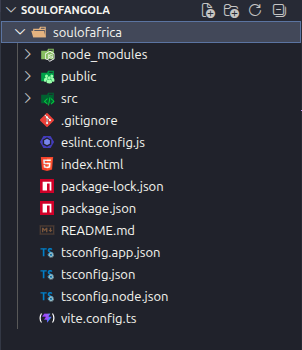
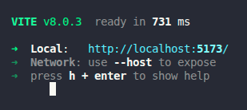
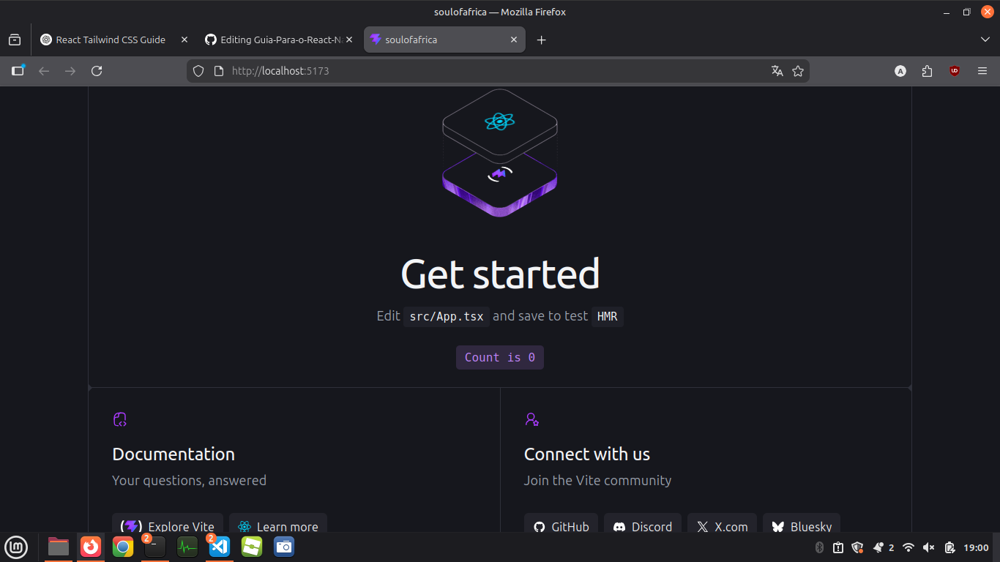
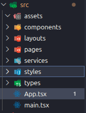
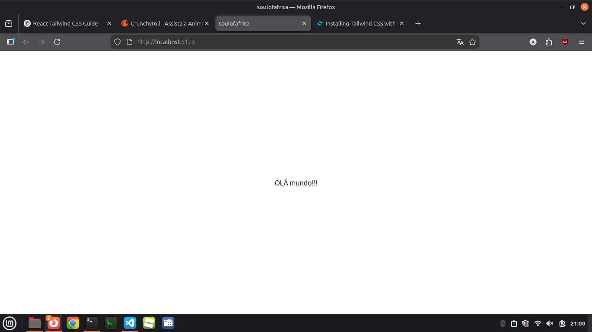
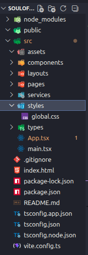

# **Guia Para o React Native**

## ÍNDICE

1. Instalação dos programas;
2. Configuração do Ambiente;
3. Criação do seu primeiro projecto
4. Organização e ajustes do projecto;
--------------------------------------
## NOTA!!!

**O seguinte documento pode conter:**

1. Erros ortográficos não analisados ou corrigidos;
2. Falhas ao fechar ou ao colocar o fim das markdown (linguagem do readme.md);
3. Possivel troca de sentido ou coesão;

Isso e mais algumas pequenas coisinhas...

Qualquer erro notado, gostaria que reporta-se apartir dos meus contactos:


Instragram: @[bellbelliones](https://www.instagram.com/belliones_official/)

E-mail: **rodolfoguzman0326@gmail.com**


Desde já agradeço por usar este guia como base para o **React**, agora! Boraaaa para o códigoooo!

-----------------------------------------

## **1. Instalação dos programas**

 Para pode programar em React Native, aqui o seu amigo Rodolfo vai te dizer o que precisas instalar, sendo que é preciso ter eles na sua máquina para poder criar ou fazer outra qualquer coisa na sua aplicação, seja web ou mobile... Ok? estamos juntos?

 Baixa o programas que vou deixar em forma de link logo abaixo:

 ### Node.js

Ao entrar no site, por baixo do titulo dowload deves deixar exatamente deste jeito as caixas de informações e ao deixar do jeito que está a imagem clica no botão verde no fim para iniciar a transferência

Para que serve? para poderes rodar o teu projecto e ver como ele está a funcionar, precisas dele...

 


**Para baixar clica ->>** [AQUI](https://nodejs.org/en/download/)

--------------------------------------

### GitHub

Sempre que tu estiveres a trabalhar em desenvolvimento de algum projecto, não importa qual seja, tens que usar o git, por ele ajuda com versionamento, ou seja, com as versões do seu sistema, sempre que atualizares(adicionares alguma alteração no teu sistema) tu criar meio que um historico de versões, para quando o programa estiver em uma parte que só está a dar erros, possas voltar na versão anterior...  "você está me entendendo"(By Professor Aires)

**Para baixar clica ->>** [AQUI](https://git-scm.com/install/windows)

--------------------------------------
### Visual Studio code (Editor de Código)

Como programador/a, tu deves saber da existência desta magnífica ferramenta de desenvolvimento, não preciso falar muito, nem colocar imagem aqui é só baixar no site oficial deles.

**Para baixar clica ->>** [AQUI](https://code.visualstudio.com/)

--------------------------------------

### Node.js Package Manager Extra

Bem... é só um extra para ficar bonito no pc ksksks...

Baixa ele aí para o seu pc e instala.

**Para baixar clica ->>** [AQUI](https://classic.yarnpkg.com/lang/en/docs/install/)

--------------------------------------

### Bem para instação é apenas isso... Agora vamos entrar para a parte de criação do seu primeiro projecto...


--------------------------------------

## 2. Configuração do Ambiente;

Quando falo de configuração do ambiente, eu me refiro a questão de:

1. Instalação de extensões no VSCode(claro isto deveria estar na área de instalação, mas na verdade ele deve estar aqui mesmo);
    1.  ES7+ React/Redux Snippets
    2. Prettier
    3. ESLint
    4. Auto Rename Tag
    5. Path Intellisense
    6. Tailwind CSS IntelliSense
    7. Expo Tools
    8. React Native Tools
    9. GitLens
    10. Thunder Client
    11. NativeWind


## 3. Criação do seu primeiro projecto;

Há sempre aqueles que quando tentam fazer os dois primeiros passos, encontram um monte de erros...
E mesmo pesquisando no youtube ou no chatgpt não encontram respostas... 
É normal sim que ao criar o teu projecto venham informações em "Warning", por quê? eu também não sei, kkk estou a mentir! os "warnings" são chamadas de atenção para as versões de algum programa ou pacote dentro do seu pc que a sua versão está desatualizada... É só tu depois atualizares eles... para quem usa linux é só botar um bash(comando no terminal ou em palavras mais miúdas, no cmd...); que ele completa a atualização de tudo no pc... Mas não precisam se preocupar no início...

Para criar um novo projecto em **REACT NATIVE** tu só precisas de fazer antes uma coisa, que no caso é **Abrir a pasta raiz do projecto no VSCodeP**, por quê? por que vocês vão precisar do terminal ligado a pasta do projecto... por que no terminal já vira com o caminho do projecto e quando falo de caminho, é a localização exata do teu projecto, tipo tá aguardada dentro de uma pasta que tem pasta dele, onde essa pasta também tem pasta dele e fica assim:

``` md
/home/critical-trojan/Documentos/LAB. De programação/Git/Guia Para o React Native

```

Algo assim...

Agora que concluiu esta parte, tu rodas isso no terminal

``` md
    npm create vite@latest
```
1. Vai perguntar sobre o **create-vite@(versão atual, vai aparecer em número aqui)**, é só digitar **y**;
2. Após isso vai perguntar **project-name:** aqui tu colocas o nome do teu projecto ok? e depois dê enter;
3. Logo em seguida vai perguntar o framework, que no nosso caso é **React**;
4. Vai perguntar **Select a Variant** e tu escolhes **TypeScript** mais usado no mercado atual em empresas como as que citei acima;
5. E por ultimo vai perguntar sobre **Install with npm start now?**, tu digitas **yes** ou **y** e da enter também;

Apartir desse momento a pasta do teu projecto virá com pastas e ficheiros iniciais que chamo de **dependências**, aquilo que o projecto necessita para ser executado. E quando tudo terminar de ser baixado, veras algo como isso na pasta raiz do projecto dentro do **VSCode**:

 

E ao clicar no botão **CTRL + clicando com o cursor** no localhost:

 

Ele vai abrir o projecto no teu navegador deste jeito:

 


### E prontos, tens o teu projecto criado!!! Agora é só fazer as modificações certas kkk, e acrescentar o que for necessário!


--------------------------------------

## 4. Organização e ajustes do projecto;

### Parte introdutoria(Se quiser pular, pula)

Já criamos o nosso projecto, mas e aí? é tudo? claro que não, aqui vou ensinar também a usar o **Tailwind** ou em outros termos(mas não verdadeiros)  **Bootstrap** ! sim, atualmente precisamos ser rápidos e dinâmicos ao criar sistemas e um sistemas não pode nos fazer uma semana ou um mês, ser produtivo em menor tempo possivel, então é necessário ter esse tipo de ajuda em nossos projectos.

Você já criou classes eno **CSS** e usou no **HTML** certo? tu criavas nomes como se fossem variaveis e depois alteravas no css... o React ainda vais usar o **HTML** e também o **CSS**, caso vocÊ já tenha interagido com essas linguagens( não de programação, elas não são linguagens de programação...), Será fácil se adaptar aqui.

### Implementação!

Após ter terminado de criar o teu projecto em **REACT**

vá até a past src ou clica nele, tu precisas criar essas novas pastas e deixar apenas os arquivos que deixei do jeito que está aqui:



vá até ao arquivo **main.tsx** e elimina o import com nome App.css ok? e deixa assim:

```md
import { StrictMode } from 'react'
import { createRoot } from 'react-dom/client'
import App from './App.tsx'

createRoot(document.getElementById('root')!).render(
  <StrictMode>
    <App />
  </StrictMode>,
)

```
Não vamos usar aquele import...

Na pasta raiz do teu projecto verás um arquivo com o nome **eslint** qualquer coisa, elimina ela... 

Vá para o **package.json** e deixa assim:

```md
{
  "name": "soulofafrica",
  "private": true,
  "version": "0.0.0",
  "type": "module",
  "scripts": {
    "dev": "vite",
    "build": "tsc -b && vite build",
    "preview": "vite preview"
  },
  "dependencies": {
    "@tailwindcss/vite": "^4.2.2",
    "react": "^19.2.4",
    "react-dom": "^19.2.4"
  },
  "devDependencies": {
    "@types/node": "^24.12.0",
    "@types/react": "^19.2.14",
    "@types/react-dom": "^19.2.3",
    "@vitejs/plugin-react": "^6.0.1",
    "autoprefixer": "^10.4.27",
    "globals": "^17.4.0",
    "postcss": "^8.5.8",
    "tailwindcss": "^4.2.2",
    "typescript": "~5.9.3",
    "typescript-eslint": "^8.57.0",
    "vite": "^8.0.1"
  }
}

```

O que aconteceu? só eliminaste tudo que tem haver com o arquivo **eslint** que você apagou para não der erro depois...
### Verás que está a faltar aquivos na minha pasta src, mas na verdade é para eliminar mesmo, o que você ver que não tenho é para eliminar na tua pasta src, atenção! isso que estás a ver é a pasta src ok? a estrutura da pasta src.

Entra no **App.tsx** e deixa assim:

``` md
export default function App ()
{
 return(
  <>
    <div classname="">
       <div>
          Olá mundo!!!
       </div>
    </div>
 </>
)
}
```

Agora tu precisas rodar no terminal ou no cmd neste caso(Atenção! no cmd ele deve estar dentro da pasta raiz do projecto), o seguinte código:

Intalando as dependencias do npm no projecto
``` md 
  npm install
```
 Isso vai garantir que o teu projecto tenha o que precisamos para o decorrer do desenvolvimento.

### NOTA!!!
Quando você cria o teu projecto, ele por padrão cria o server para ti e mostra o projecto, mas quando precisas ver de novo o teu projecto, tu precisas criar este mesmo server de novo, e para tal, tu rodas;

``` md
npm run dev
```
### Fim Nota

### INSERINDO E CONFIGURANDO O TAILWIND CSS

Agora chegou a hora de nós coloocarmos o **Tailwind** no teu projecto... Vai dentro da pasta do seu projecto no **CMD**.

**Instalando TailwindCss no seu projecto**
``` md
npm install tailwindcss @tailwindcss/vite
```

Podes colcoar de uma vez ou em separado, mais se for de uma vez, clica no botão de copiar desse bash aí.

**Configurando o Arquivo "vite.config.ts"**

Após instalar, clica no arquivo dentro projecto com o nome **vite.config.ts** e adiciona essas duas linhas de codigo...

Por baixo dos outros import coloca isso:
``` md
import tailwindcss from '@tailwindcss/vite'
```
e dentro disso

```md
// https://vite.dev/config/
export default defineConfig({
  plugins: [react()],
})
```
deixa assim:

```md
// https://vite.dev/config/
export default defineConfig({
  plugins: [
    react(),
    tailwindcss(),
  
  ],
})
```

Vá até a pasta src, e cria uma pasta com o nome **styles** ele vai guardar o nosso css global com o nome:
```md
global.css
```
Dentro desse arquivo global tu importas o tailwindcss:

``` md
@import "tailwindcss";
```
### NOTA: Não esqueça de salvar tudo que estamos a fazer!

Agora só precisas importar esse arquivo global css com o tailwind css para as páginas do teu sistema, como o **App.tsx** dentro do **src**, coloca:

```md
import "./styles/global.css";
```

e vai ficar assim o arquivo:

```md
import "./styles/global.css";
function App() {
  return (
    <>
      <div className="h-screen flex justify-center items-center">
        <div className="">OLÁ mundo!!!</div>
      </div>
    </>
  )
}

export default App
```

roda de novo no terminal dentro do teu projecto(caso ainda não tenhas iniciado o servidor):

```md
npm rund dev
```

clica no localhost com a tecla **CTRL + click do mouse** e vai te redirecionar para o navegador para ver o que foi alterado, ele ficará assim:




No fim a pasta completa fica:



### Prontoooo, agora tu podes usar o teu TailwindCss em todo o seu projecto!
------------------------------

# Ainda escrevendo o resto do guia...
