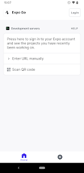

# **Guia Para o React Native**

## ÍNDICE

1. Instalação dos programas;
2. Configuração do Ambiente;
3. Criação do seu primeiro projecto;
4. Conceitos básicos da linguagem;
--------------------------------------


## **1. Instalação dos programas**

 Para pode programar em React Native, aqui o seu amigo Rodolfo vai te dizer o que precisas instalar, sendo que é preciso ter eles na sua máquina para poder criar ou fazer outra qualquer coisa na sua aplicação, seja web ou mobile... Ok? estamos juntos?

 Baixa o programas que vou deixar em forma de link logo abaixo:

 ### Node.js

Ao entrar no site, por baixo do titulo dowload deves deixar exatamente deste jeito as caixas de informações e ao deixar do jeito que está a imagem clica no botão verde no fim para iniciar a transferência

Para que serve? para poderes rodar o teu projecto e ver como ele está a funcionar, precisas dele...

 


**Para baixar clica ->>** [AQUI](https://nodejs.org/en/download/)

--------------------------------------

### GitHub

Sempre que tu estiveres a trabalhar em desenvolvimento de algum projecto, não importa qual seja, tens que usar o git, por ele ajuda com versionamento, ou seja, com as versões do seu sistema, sempre que atualizares(adicionares alguma alteração no teu sistema) tu criar meio que um historico de versões, para quando o programa estiver em uma parte que só está a dar erros, possas voltar na versão anterior...  "você está me entendendo"(By Professor Aires)

**Para baixar clica ->>** [AQUI](https://git-scm.com/install/windows)

--------------------------------------
### Visual Studio code (Editor de Código)

Como programador/a, tu deves saber da existência desta magnífica ferramenta de desenvolvimento, não preciso falar muito, nem colocar imagem aqui é só baixar no site oficial deles.

**Para baixar clica ->>** [AQUI](https://code.visualstudio.com/)

--------------------------------------

### Expo Go

Olha... Se o seu seu computador é uma batata que nem a minha, recomendo imenso tu baixar isso viu? Esse é um aplicativo para telemóvel, com ele tu poderás ver a tua aplicação rodando no seu telemóvel sem precisar ter que criar o apk e  depois instalar no teu telemóvel, mesmo quem tem bom pc pode usar ele...

Só pesquisar na **PlayStore** por **ExpoGo** e baixar;


--------------------------------------

### Node.js Package Manager Extra

Bem... é só um extra para ficar bonito no pc ksksks...

Baixa ele aí para o seu pc e instala.

**Para baixar clica ->>** [AQUI](https://classic.yarnpkg.com/lang/en/docs/install/)

--------------------------------------

### Bem para instação é apenas isso... Agora vamos entrar para a parte de criação do seu primeiro projecto...


--------------------------------------

## 2. Configuração do Ambiente;

Quando falo de configuração do ambiente, eu me refiro a questão de:

1. Instalação de extensões no VSCode(claro isto deveria estar na área de instalação, mas na verdade ele deve estar aqui mesmo);
    1.  ES7+ React/Redux Snippets
    2. Prettier
    3. ESLint
    4. Auto Rename Tag
    5. Path Intellisense
    6. Tailwind CSS IntelliSense
    7. Expo Tools
    8. React Native Tools
    9. GitLens
    10. Thunder Client
    11. NativeWind
2. Checagem do ExpoGo no telemóvel(Ele deve estar a funcionar corretamente, ou seja, basta ele abrir);
 

4. Checar se seu telemóvel consigue tirar foto um pouquinho com qualidade;

## 3. Criação do seu primeiro projecto;

Há sempre aqueles que quando tentam fazer os dois primeiros passos, encontram um monte de erros...
E mesmo pesquisando no youtube ou no chatgpt não encontram respostas... 
É normal sim que ao criar o teu projecto venham informações em "Warning", por quê? eu também não sei, kkk estou a mentir! os "warnings" são chamadas de atenção para as versões de algum programa ou pacote dentro do seu pc que a sua versão está desatualizada... É só tu depois atualizares eles... para quem usa linux é só botar um bash(comando no terminal ou em palavras mais miúdas, no cmd...); que ele completa a atualização de tudo no pc... Mas não precisam se preocupar no início...

Para criar um novo projecto em **REACT NATIVE** tu só precisas de fazer antes uma coisa, que no caso é **Abrir a pasta raiz do projecto no VSCodeP**, por quê? por que vocês vão precisar do terminal ligado a pasta do projecto... por que no terminal já vira com o caminho do projecto e quando falo de caminho, é a localização exata do teu projecto, tipo tá aguardada dentro de uma pasta que tem pasta dele, onde essa pasta também tem pasta dele e fica assim:

``` md
/home/critical-trojan/Documentos/LAB. De programação/Git/Guia Para o React Native

```

Algo assim...

Agora que concluiu esta parte, tu rodas isso no terminal

``` md
    npm create vite@latest
```
1. Vai perguntar sobre o **create-vite@(versão atual, vai aparecer em número aqui)**, é só digitar **y**;
2. Após isso vai perguntar **project-name:** aqui tu colocas o nome do teu projecto ok? e depois dê enter;
3. Logo em seguida vai perguntar o framework, que no nosso caso é **React**;
4. Vai perguntar **Select a Variant** e tu escolhes **TypeScript** mais usado no mercado atual em empresas como as que citei acima;
5. E por ultimo vai perguntar sobre **Install with npm start now?**, tu digitas **yes** ou **y** e da enter também;

Apartir desse momento a pasta do teu projecto virá com pastas e ficheiros iniciais que chamo de **dependências**, aquilo que o projecto necessita para ser executado. E quando tudo terminar de ser baixado, veras algo como isso na pasta raiz do projecto dentro do **VSCode**:

 

E ao clicar no botão **CTRL + clicando com o cursor** no localhost:

 

Ele vai abrir o projecto no teu navegador deste jeito:

 


### E prontos, tens o teu projecto criado!!! Agora é só fazer a modificações certas kkk, e acrescentar o que for necessário!
