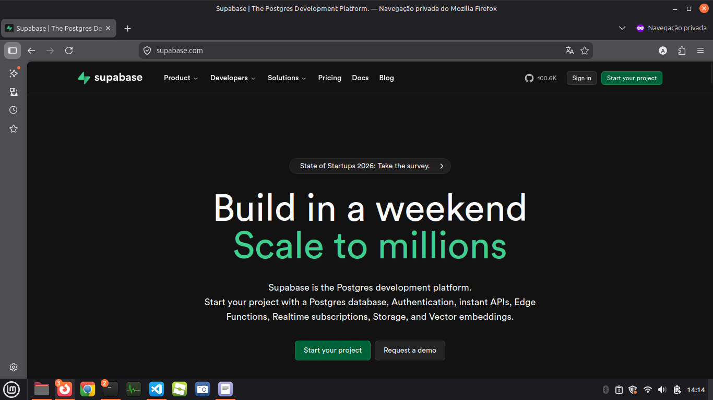
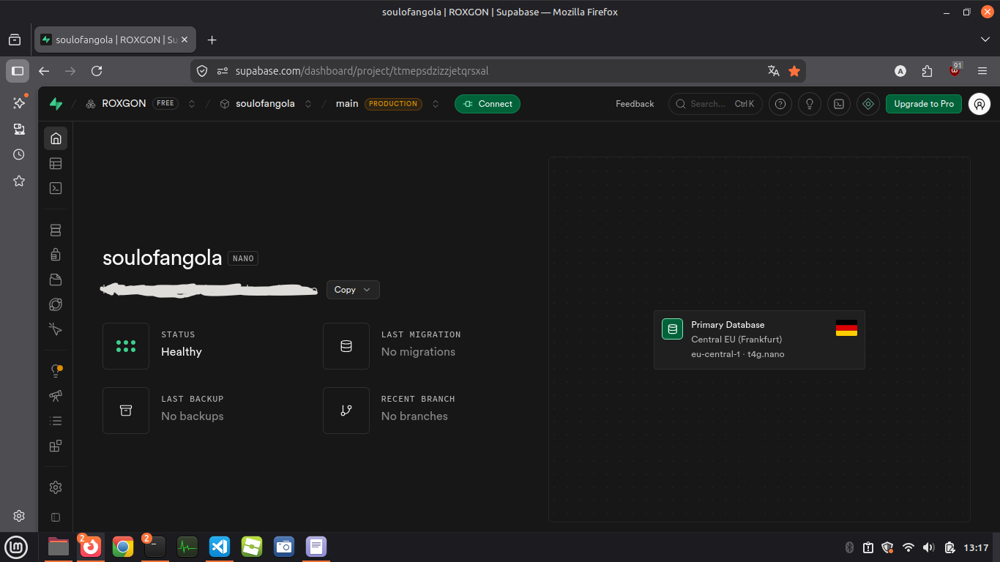
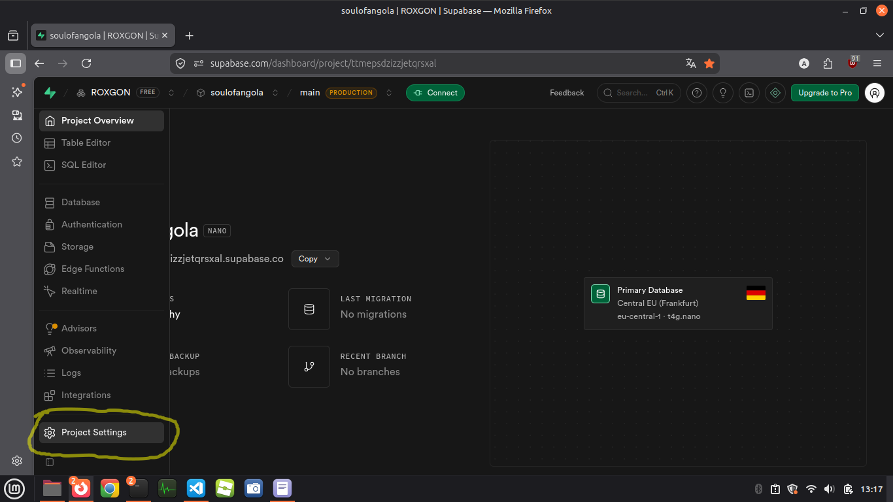
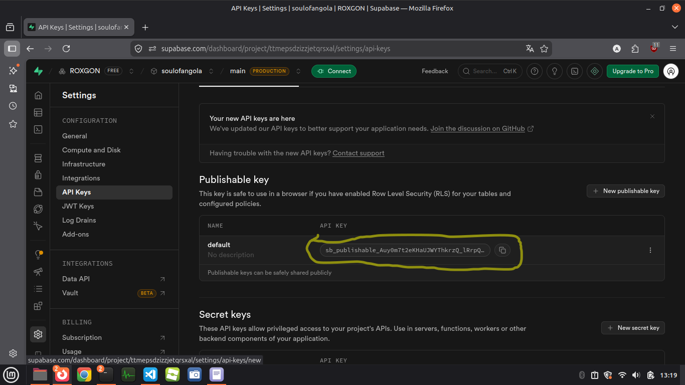
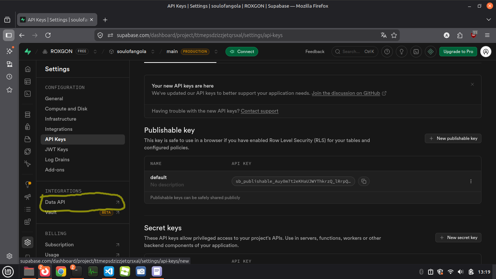
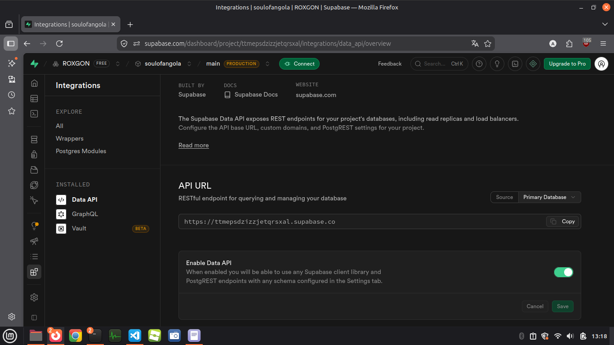
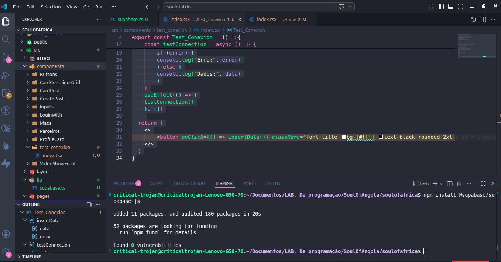

# COMO CONECTAR O TEU PROJECTO REACT COM O BANCO DE DADOS RELACIONAL SUPABASE?


[<- Voltar ao guia do React](./README.md)

## 1. Criar uma conta e um projecto no Supabase:

Para conectar primeiro tens que ir até ao site oficial do supabase([Clica Aqui](https://supabase.com/)), e tentar fazer login(caso já tenhas uma conta) ou criar uma conta.


 

Para criar uma conta tu podes fazer de dois jeitos:

1. Iniciando com o Github( O que eu mais recomendo, por ser rápido e tendo outros benefícios);
2. Criar com o seu e-mail e confirmar o e-mail com a mensagem que vão mandar para ti na caixa de mensagens do e-mail;

Após criar ou ter iniciado a sessão, e se fores novo, ele vai pedir o nome da tua organização(startup, empresa, ou pessoal), e alguns dados de localização, se fores angolano, não havera lá a tua região, deixa mesmo **Europeo** e depois é só clicar em **Create Organization**. 

Agora a parte de **Criação do Projecto**, logo após criar a organização. ele vai aparecer em seguida, pedindo o nome do **projecto** e não o seu nome... E a **senha do projecto** então, coloca uma boa senha até a barra por baixo da caixa de password estar verde, e não te esqueças de copiar e guardar essa senha em algum lugar permanente onde possas acessar em qualquer lugar e em disposivos diferentes, nunca se sabe o que pode acontecer ao seu pc ou telemóvel...

Criou a organização? Já tem o projecto? então a área que vais ser direcionada é mais ou menos esta:


 

Agora vá em **Settings** depois **API Keys** e copie a chave que vai estar no canto direito por baixo do titulo **Publishable key** a frente da label **Default:**, copie ela é a sua chave.

1. 
2. 

Agora para o endereço ou URL do seu projecto, vai em **Integrations -> Data API** e onde estiver o titulo **API URL** copia o endereço que veres.


1. 
2. 

Tens que copiar esses dois elementos importantes, por que serão a ligação entre o seu projecto e a base de dados e guardar em algum lugar, para depois podermos usar.

## 2. Instalação e configuração do Supabase no projecto

Então, após criar o projecto, **Instala as Dependências do Supabase no seu Projecto** rodando este código no terminal:



``` md
npm install @supabase/supabase-js

```

A instalação pode levar algum tempo então, enquanto isso podes criar o arquivo que vai conter essa conexão.

Na tua pasta **src** cria uma outra pasta **lib** e dentro dessa pasta cria o arquivo com nome que achares mais fácil de decorar ou lembrar, no meu caso será **supabase.ts**, e dentro desse arquivo to copias e colas lá dentro este código:


```med
import { createClient } from '@supabase/supabase-js'

const supabaseUrl = "SUA_URL_AQUI"
const supabaseAnonKey = "SUA_KEY_AQUI"

export const supabase = createClient(supabaseUrl, supabaseAnonKey)
```

É aqui que aqueles dois elementos entram, busca a URL que copiou e cola onde está escrito **SUA_URL_AQUI** e logo em seguida pega na **API KEY** que você guardou e cola onde está escrito **SUA_KEY_AQUI**, e prontos, garantiste o arquivo que vai se responsabilizar por ser a ponte entre a base de dados e o teu projecto.

## 3. Testando a conexão

No teu projecto do **Supabase** na internet vai estar no painel principal certo? no teu canto esquerdo, terá algumas opções, no nosso caso, vamos criar uma tabela **test** para ver se há realmente uma conexão, ou seja. vamos testar a conexão.

No menu a esquerda. procurar por **Table Editor** E clica.


Vai abrir esta área de criação de tabelas, agora clica em new table:


E vai te abrir um aba para preencher com os dados dessa mesma tabela, primeiro vai te pedir um nome, coloca **test** e depois, logo a baixo estarão os campos, por padrão verás os campos **ID** e **created at**, esses campos são padrão, pode deixar assim mesmo viu?, só adiciona uma nova coluna, clicando em **add column** chamada **name** para o nome, e na parte do type, ou tipo de dados tu deixas como **text**, e por ultimo tu clicas em **Save**.


Agora que tens a tabela criada, vamos simular uma busca de dados e insersão nessa tua tabela para ver se há fluxo de informações.


No menu a esquerda procurar por **Authentication** e clica, vai te mostrar um outro menu a esquerda, procura na áre do menu com o nome **Configuration** e encontre a opção **Policies** e clica nela.


Agora no lado direito, se prestares atenção, verás a tabela que você criou, agora é só clicar no botão **create policy**, que vai abrir está área


Onde poderas escolher que tipo de operações ou **Policy Command for clause** que a tua tabela pode realizar, se olhares no canto direito dessa aba de configuração, veras opções como **SELECT, INSERT, E AÍ VAI** selecione o **SELECT** e depois no **Target Roles** tu deixar como pública, ou seja **Defaults to all (public) roles if none selected** desse jeito ok? e por fim, desce até o fim dessa página e **Save** salva essa **policy**. Cria uma nova **Policy** e Repita o mesmo procedimento, mas desta vez com uma **Policy Command for clause** diferente, que no nosso caso vai ser inserir ok? então seleciona **INSERT** e deixa a **Role** como publica também.


Agora essa tabela pode mostrar e inserir informações vindas do teu projecto, só falta agora testar isso.

No teu projecto react, vai na tua pasta **src** e dentro dessa pasta, seleciona a pasta **components** e cria uma nova pasta chamada:

``` md
test_conexion

```

E dentro dessa pasta cria um ficheiro de nome:

``` md
index.tsx
```

E cola lá o seguinte código:

```md
import { useEffect } from "react"
import { supabase } from "../../lib/supabase"

export const Test_Conexion = () =>{
    const insertData = async () => {
  const { data, error } = await supabase
    .from('test')
    .insert([{ name: "Ana" }])

  console.log(data, error)
}
    

    const testConnection = async () => {
        const { data, error } = await supabase
        .from('test')
        .select('*')

        if (error) {
        console.log("Erro:", error)
        } else {
        console.log("Dados:", data)
        }
    }
    useEffect(() => {
    testConnection()
    }, [])
    
  return (
    <>
        <button onClick={() => insertData()} className="font-title bg-[#fff] text-black rounded-2xl p-10"> Inserir</button>
    </>
  )
}
```

Isso é só para testar kkk, agora vá até ao teu arquivo **App.tsx** que fica dentro do **src** e coloca a função mas dentro do return com uma tag inicial, o componente que você criou, que é neste caso o **<Test_Conexion />**. E agora, vai no terminal desse mesmo projecto no **VSCode** e executa o comando para rodar o teu projecto:

``` md
npm run dev
```

Quando você abrir esse seu projecto no **navegador** clica **F12** ou apenas clica com o botão direito do mouse no teu sistema web no navegador e clica em inspecionar, onde logo em seguida clicas em console, e tenta ver se veio algo do tipo:


Se apareceu, é por que pegou a tabela, mas não viu nenhuma informação, no botão que veres no teu sistema:


Tu clicas, se aparecer isso no console:


Quer dizer que inseriu, vai no teu projecto no **Supabase** do navegador, vai em **Table Editor** como ensinei, e verás a tua direita a tabela, já com algumas informações.


### e Prontos, tens um arquivo que cria a conexão com a tua tabela, e testaste* a tua conexão, pegando e inserindo informações na tabela

-------------------

### Ainda escrevendo o resto do guia adicional "React + Supabase"


Dúvidas e erros, me consulte apartir dos contactos deixados na página anterior!!!
